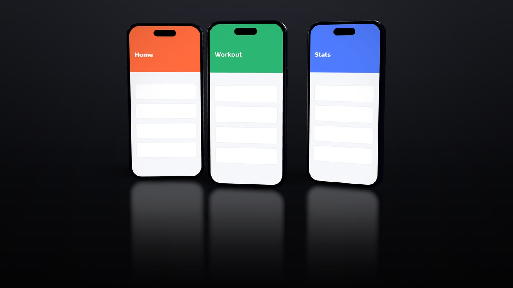
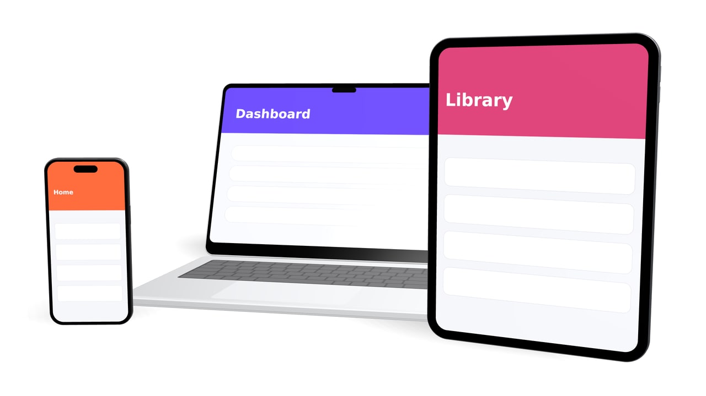
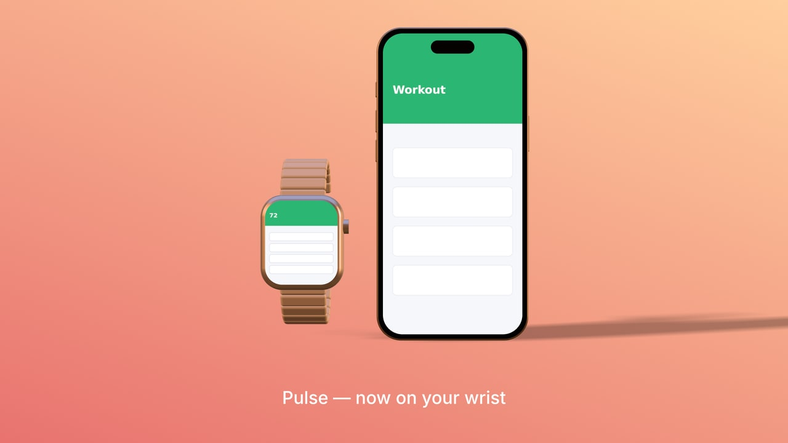
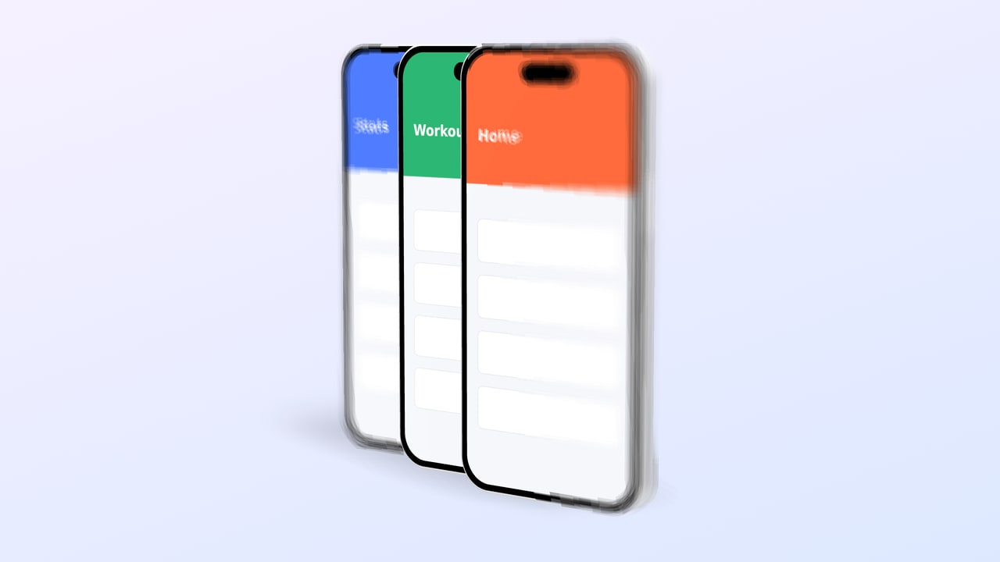

# devicewrapper

Headless 3D device mockups for AI agents. An MCP server that lets Claude Code (or any MCP client) build scenes with phones, tablets, laptops, monitors and watches, put your app screenshots or screen recordings on their screens, light, frame and animate them, and render stills and videos. No UI.

<p align="center">
  
  
  
  
</p>

> **Status:** all seven phases of [PLAN.md](PLAN.md) are done: scene format, engine, MCP server, stills and video (MP4, WebM, ProRes, with transparency), six device models, layouts, styles, motion presets, 15 templates, one-call `compose_scene`, localized text, depth of field, bloom, reflective floors, and docs checked by an agent eval. Not yet on npm (see [Publishing](docs/using.md#publishing)). Design choices and limitations: [DECISIONS.md](DECISIONS.md).

## Setup

Requires Node 20+, pnpm, and FFmpeg for video.

```bash
git clone https://github.com/ismaelviejo/devicewrapper.git
cd devicewrapper
pnpm install
pnpm build
pnpm setup        # downloads the headless Chromium used for rendering
```

## Use it from Claude Code in another project

Full guide: [docs/using.md](docs/using.md) (other MCP clients, configuration, security, CLI, library use, Docker).

From the project you want mockups in:

```bash
cd ~/code/my-app
claude mcp add devicewrapper -- node /path/to/devicewrapper/packages/cli/dist/index.js mcp
```

Or commit a `.mcp.json` in that project:

```json
{
  "mcpServers": {
    "devicewrapper": {
      "command": "node",
      "args": ["/path/to/devicewrapper/packages/cli/dist/index.js", "mcp"]
    }
  }
}
```

The workspace is the directory the server starts in (override with `DEVICEWRAPPER_WORKSPACE`). Scenes, job records and renders go in `<workspace>/.devicewrapper/`, so add that to the project's `.gitignore` if you don't want renders committed. Screenshots are referenced in place by workspace-relative path. The server can't read or write outside the workspace; `.env.example` shows how to allow extra folders.

Then ask Claude things like:

> Make a 1080p hero shot of a silver phone showing `design/screens/home.png`, turned slightly, on a soft lavender gradient with a subtle shadow. Show me a preview first.

> Put `a.png`, `b.png` and `c.png` on three midnight phones in a slight arc on a dark studio background, add the headline "Train smarter", and render it in English and Spanish.

> Make a 5-second 1080p MP4: a black phone playing `design/onboarding.mp4`, slowly turning while the camera pushes in. Draft it small first.

> Use the phone-laptop template with `web/dashboard.png` and `app/home.png`, dark studio style, and a laptop lid-open reveal.

## What the agent gets

**Tools (31)**

| Area | Tools |
|---|---|
| Compose | `compose_scene` (one call from a brief or template), `list_templates`, `apply_layout`, `apply_style`, `apply_motion` |
| Scenes | `create_scene`, `list_scenes`, `get_scene`, `update_scene`, `duplicate_scene`, `delete_scene`, `validate_scene`, `import_scene`, `export_scene` |
| Nodes | `add_device`, `add_node` (plane, primitive, group, text), `update_node`, `remove_node` |
| Look | `set_camera` (auto-framing shots), `set_lights` (presets), `set_background`, `set_effects` |
| Motion | `set_track`, `remove_track` |
| Assets & text | `import_asset`, `set_variables` (localization) |
| Rendering | `render_preview` (returns the image inline), `render`, `get_render_job`, `list_render_jobs`, `cancel_render_job` |

Full reference: [tools](docs/tools.md), [resources](docs/resources.md), [catalog](docs/catalog.md), [examples](docs/examples.md).

**Resources:** `devicewrapper://guide` (workflow and composition tips), `schema/scene` (JSON Schema), `devices`, `presets`, `animatable`, `capabilities`, and every saved scene at `devicewrapper://scenes/{id}`.

**Devices:** `phone-modern`, `phone-classic`, `tablet`, `laptop-14` (animatable lid), `monitor-27`, `watch-45`, each with color variants. Add your own with a JSON file in `.devicewrapper/devices/`.

**Templates (15):** hero-phone, hero-laptop, phone-pair, phone-trio, phone-tablet, phone-laptop, floating-phone, device-grid, device-carousel, app-store-hero, dark-product-shot, light-product-shot, watch-hero, desktop-setup, laptop-reveal. Add your own briefs in `.devicewrapper/templates/`.

**Styles:** light-studio, dark-studio, soft-gradient, midnight-neon, sunset, mint, product-white, transparent, glossy-dark, glossy-light. **Layouts:** hero, row, arc, fan, stack, grid, circle, showcase. **Motions:** 23 presets (float, slow-turn, turntable, rise, enter/exit, spin-reveal, lid-open, orbit, push-in, pan, crane, zoom …).

## CLI

```bash
devicewrapper mcp                         # MCP server over stdio
devicewrapper render hero -o hero.png     # scene ID or path/to/scene.json; format from the extension
devicewrapper render hero -o hero-es.jpg --locale es --width 2560
devicewrapper render hero -o hero.mp4 --width 1280     # video: .mp4 .webm .mov, progress on stderr
devicewrapper validate hero
devicewrapper scenes
devicewrapper devices
devicewrapper setup
```

(From a clone, `devicewrapper` is `node packages/cli/dist/index.js`.)

## Packages

| Package | What it does |
|---|---|
| `@devicewrapper/schema` | Zod schemas for the scene format; JSON Schema export |
| `@devicewrapper/core` | Pure scene operations, validation, timeline evaluation, camera framing, layouts, styles, motions, compose + templates, workspace, scene store, assets, device definitions and presets |
| `@devicewrapper/renderer` | Three.js in headless Chromium (driven over a DevTools pipe); textures with sharp; video with FFmpeg |
| `@devicewrapper/jobs` | `Engine` facade and the render job queue |
| `@devicewrapper/mcp` | The MCP server |
| `devicewrapper` | CLI |

## Development

```bash
pnpm build
pnpm typecheck
pnpm test:unit        # fast, no browser
pnpm test:golden      # renders and compares against tests/golden/reference
pnpm test             # both
pnpm run docs:gen             # regenerate docs/tools.md, resources.md, catalog.md from the live server
node scripts/gen-examples.mjs   # re-render the example gallery
```

Rendering is deterministic by default (`DEVICEWRAPPER_RENDER_MODE=deterministic`, CPU WebGL), so golden tests compare pixels. `docker/Dockerfile` builds a pinned render environment.

Docs index: [docs/](docs/README.md). See [PLAN.md](PLAN.md) for the roadmap, [DECISIONS.md](DECISIONS.md) for design choices, and [CLAUDE.md](CLAUDE.md) for the working rules.
