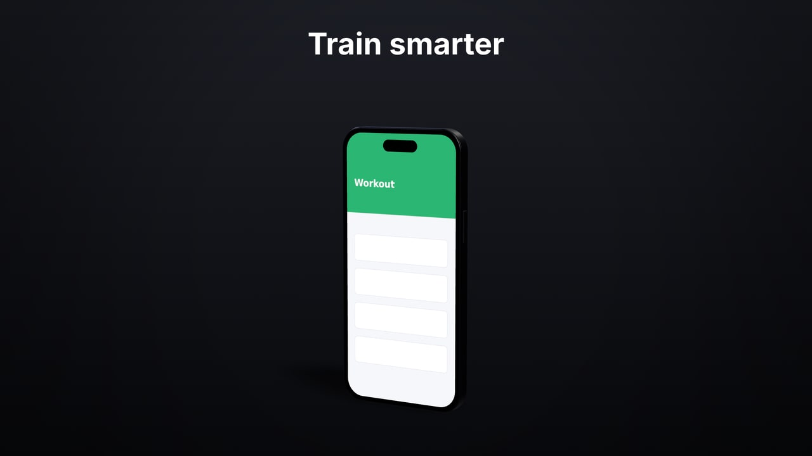
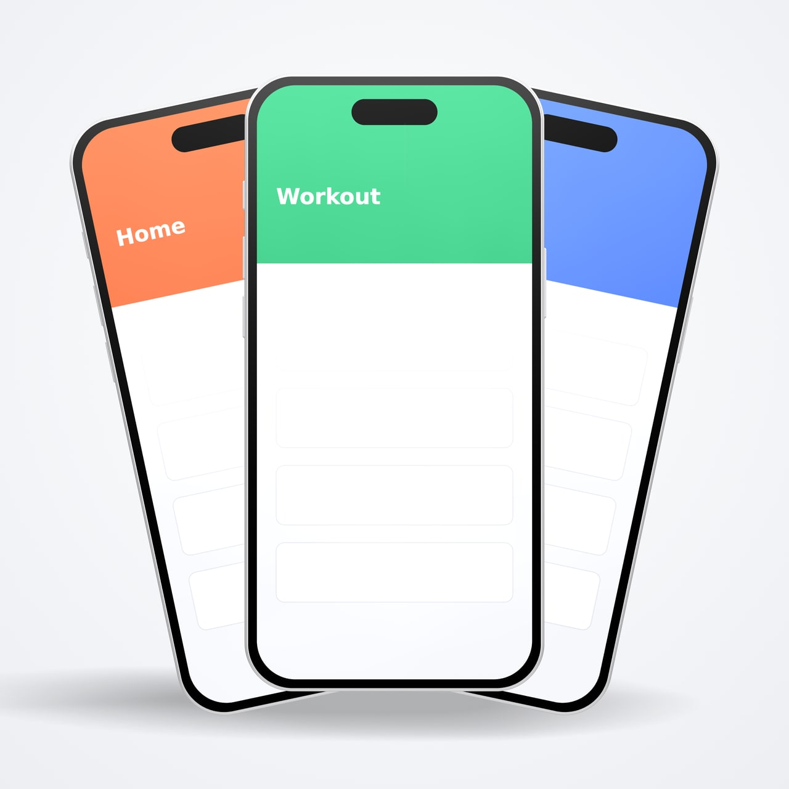
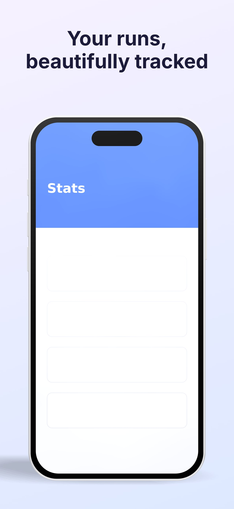
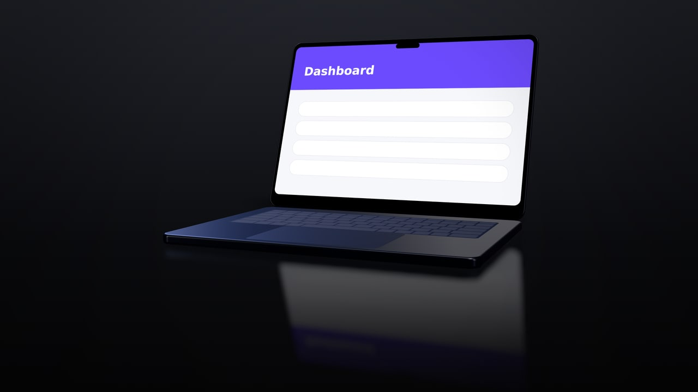

# Examples

Every image here was rendered by `node scripts/gen-examples.mjs` from the brief under it (one `compose_scene` call, then `render`). The screenshots are simple placeholders; yours go in their place. Rendered at 1280 px wide, JPEG.

## Dark hero with headline

One phone, dark studio, headline.



```json
{"preset": "1080p", "style": "dark-studio", "devices": [{"model": "phone-modern", "color": "black", "screen": "screens/workout.png"}], "text": [{"content": "Train smarter", "position": "top"}]}
```

## Trio on a glossy table

Three phones in an arc on a glossy black table (reflective floor, softbox reflections).


```json
{"preset": "1080p", "style": "glossy-dark", "layout": "arc", "devices": [{"model": "phone-modern", "screen": "screens/home.png"}, {"model": "phone-modern", "screen": "screens/workout.png"}, {"model": "phone-modern", "screen": "screens/stats.png"}]}
```

## Fan, square

Fan layout, square format, light studio.



```json
{"preset": "square", "style": "light-studio", "layout": "fan", "devices": [{"model": "phone-modern", "color": "silver", "screen": "screens/home.png"}, {"model": "phone-modern", "color": "silver", "screen": "screens/workout.png"}, {"model": "phone-modern", "color": "silver", "screen": "screens/stats.png"}]}
```

## Laptop, tablet and phone

Laptop, tablet and phone together (showcase layout), white product look.


```json
{"preset": "1080p", "style": "product-white", "layout": "showcase", "devices": [{"model": "laptop-14", "color": "silver", "screen": "screens/dashboard.png"}, {"model": "tablet", "screen": "screens/tablet.png"}, {"model": "phone-modern", "screen": "screens/home.png"}]}
```

## Watch and phone at sunset

Watch and phone, sunset style and environment, bottom caption.


```json
{"preset": "1080p", "style": "sunset", "layout": "row", "devices": [{"model": "watch-45", "screen": "screens/watch.png"}, {"model": "phone-modern", "color": "natural", "screen": "screens/workout.png"}], "text": [{"content": "Pulse — now on your wrist", "position": "bottom"}]}
```

## Stack with depth of field

Stacked phones with depth of field focused on the front one.


```json
{"preset": "1080p", "style": "soft-gradient", "layout": "stack", "camera": {"focalLength": 85, "dof": 0.5}, "devices": [{"model": "phone-modern", "screen": "screens/stats.png"}, {"model": "phone-modern", "screen": "screens/workout.png"}, {"model": "phone-modern", "screen": "screens/home.png"}]}
```

## App Store screenshot

Template app-store-hero, portrait 6.9" App Store size.



```json
{"template": "app-store-hero", "screens": ["screens/stats.png"], "variables": {"headline": "Your runs, beautifully tracked"}}
```

## Laptop reveal (video frame)

Template laptop-reveal on glossy-dark: lid opens, screen wakes (frame at 3.5 s of the video).



```json
{"template": "laptop-reveal", "screens": ["screens/dashboard.png"], "style": "glossy-dark"}
```

## Prompts that work well

You don't write briefs yourself; you ask your agent. Things like:

> Make a 1080p hero of a black phone showing `design/home.png` on a dark studio background with the headline "Train smarter". Preview it first.

> Three phones with `a.png`, `b.png`, `c.png` in an arc on a glossy black table. Render a PNG and a 6-second MP4 where the whole group turns slowly.

> App Store screenshots for all five screens in `store/`, portrait 6.9", headline from `store/headlines.json`, in English, Spanish and Japanese.

> A laptop showing `web/dashboard.png` whose lid opens, then the camera pushes in. 4 seconds, dark and premium. Draft it small first.

> Our app on a phone and a watch side by side, warm sunset mood, caption at the bottom. Transparent PNG as well so I can use it on the website.

Tips:

- Ask for a preview first; the agent sees the image and fixes framing or colors before the slow final render.
- Name the mood ("premium", "playful", "clean store listing") as well as the facts; the agent maps it to a style.
- For videos, ask for a small draft, then the final size.
- Scenes are saved. "Same scene, but in Spanish" or "swap the middle screenshot" are cheap follow-ups.
